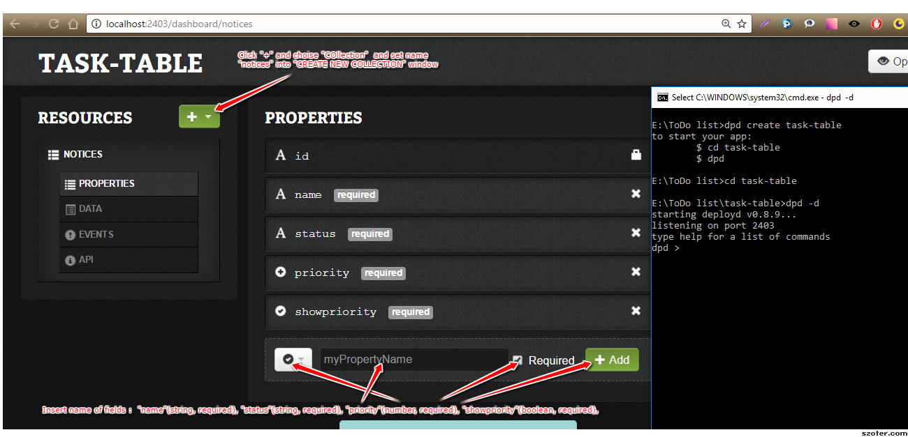

## TestList 
 
This project was generated with [Angular CLI](https://github.com/angular/angular-cli) version 1.0.1.

Other technologies used:

* [**A**ngular 2](https://angular.io) (TypeScript)
* [**A**ngular CLI](https://cli.angular.io/) (TypeScript)
* [**N**ode.js](https://nodejs.org)
* [**M**ongoDB](http://www.mongodb.com)
* [**M**aterial Design](https://material.io/)
* [**R**xJS](http://reactivex.io/rxjs/)
* [**C**ucumber](https://cucumber.io/docs/reference/javascript)
* [**W**ebPack](https://webpack.github.io/)
* [**D**eployd](http://docs.deployd.com/docs/getting-started/your-first-api.html)

## Run
You need to have **MongoDB** and **Node.js** installed to run this project.
1. `npm install dpd -g` (backend)
2. Configure dpd as follows:

3. `npm install`
4. `ng serve`
5. Go to [localhost:4200](http://localhost:4200). 

## Development server

Run `ng serve` for a dev server. Navigate to `http://localhost:4200/`. The app will automatically reload if you change any of the source files.

## Build

Run `ng build` to build the project. The build artifacts will be stored in the `dist/` directory. Use the `-prod` flag for a production build.

## Tests BDD (Cucumber + Protractor)

Run `ng e2e` to start BDD tests.

## Preview

The server will auto restart on changes.

## Further help

To get more help on the Angular CLI use `ng help` or go check out the [Angular CLI README](https://github.com/angular/angular-cli/blob/master/README.md).
